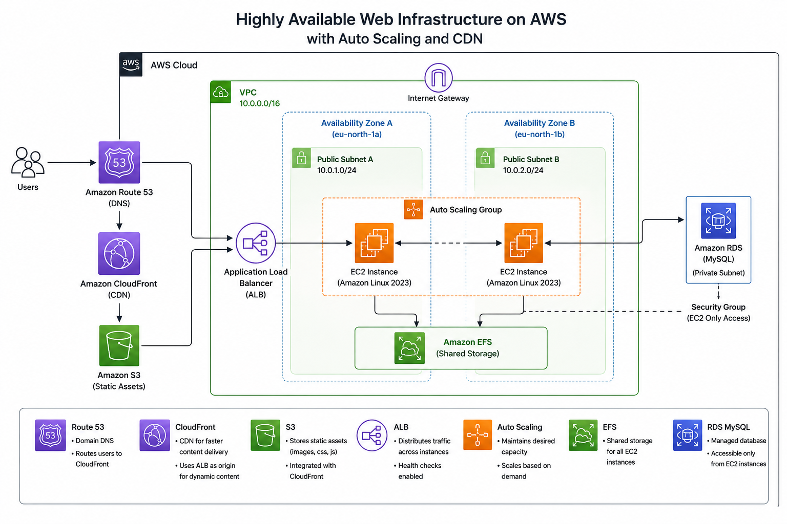

# Highly Available Web Infrastructure on AWS

## 📌 Project Overview
This project demonstrates the deployment of a **highly available, multi-AZ web architecture** on AWS. The system is designed to eliminate single points of failure by distributing traffic across multiple Availability Zones and integrating scalable cloud services for networking, storage, database management, and content delivery.

## 🏗️ Architecture
 
*The traffic flow follows a structured path: **DNS** → **CloudFront** → **Application Load Balancer** → **Auto Scaling Group (EC2)**, with data persistence handled by **EFS** and **RDS**.*

## 🛠️ Tech Stack
* **Compute:** Amazon EC2 (Amazon Linux 2023), Auto Scaling Group
* **Networking:** Amazon VPC, Application Load Balancer (ALB), Amazon Route 53, Amazon CloudFront
* **Storage & Database:** Amazon S3, Amazon EFS, Amazon RDS MySQL
* **Security:** IAM, Security Groups

## 📋 Prerequisites
To replicate this environment, ensure you have:
* An active **AWS Account**.
* **IAM Permissions** for VPC, EC2, EFS, RDS, S3, and CloudFront.
* A domain name (e.g., DuckDNS) for Route 53 testing.
* An SSH client (MobaXterm, PuTTY, or OpenSSH).

---

## 🚀 Implementation Steps

### 1. Networking & VPC Infrastructure
* **Provision a Custom VPC:** Create a VPC with CIDR `10.0.0.0/16` and enable DNS Hostnames.
* **Subnet Strategy:** Deploy two public subnets across `eu-north-1a` and `eu-north-1b` for fault tolerance.
* **Routing:** Attach an Internet Gateway and configure the public route table to allow outbound traffic (`0.0.0.0/0`).

### 2. Shared Data Layer (EFS & RDS)
* **Amazon EFS:** Create a Regional EFS file system. Install `amazon-efs-utils` on EC2 and mount the shared volume to `/var/www/html/` to ensure content consistency across all instances.
* **Amazon RDS:** Deploy a MySQL instance (`db.t3.micro`). The RDS Security Group is restricted to only allow inbound traffic on port `3306` from the EC2 security group.

### 3. Compute & Auto Scaling
* **Golden Image:** Create a custom AMI from a pre-configured EC2 instance running NGINX.
* **Auto Scaling:** Deploy an ASG (Min: 2, Desired: 2, Max: 4) to automatically handle traffic spikes and replace unhealthy instances.

### 4. Traffic Distribution & CDN
* **ALB:** Set up an Application Load Balancer to perform health checks and distribute HTTP traffic across instances.
* **CloudFront:** Layer a CDN on top of the ALB to **improve content delivery performance and reduce latency**.

---

## 🚧 Challenges & Key Learnings

| Challenge | Resolution |
| :--- | :--- |
| **CloudFront Routing** | Corrected origin path and protocol settings to resolve routing issues between the CDN and ALB. |
| **EFS Persistence** | Mounted EFS on all instances to maintain shared content consistency across multiple Availability Zones. |
| **DNS Configuration** | Navigated DuckDNS limitations by using Route 53 to manage testing for custom domain routing. |
| **Security Rules** | Implemented strict Security Group rules to restrict RDS MySQL access solely to the EC2 security group. |

## 🧹 Cleanup (Avoiding AWS Charges)
To avoid unexpected charges after testing, remove resources in this order:
1. Disable and Delete **CloudFront Distribution**.
2. Delete **Auto Scaling Group** and **ALB**.
3. **Delete the RDS instance and EFS file system.**
4. Empty and Delete **S3 Buckets**.
5. Delete the **VPC** and associated networking resources.

## 🔮 Future Improvements
* [ ] **Infrastructure as Code:** Migrate manual setup to **Terraform**.
* [ ] **CI/CD:** Automate NGINX deployments using **GitHub Actions**.
* [ ] **Monitoring:** Implement **CloudWatch** dashboards for real-time traffic analysis.
